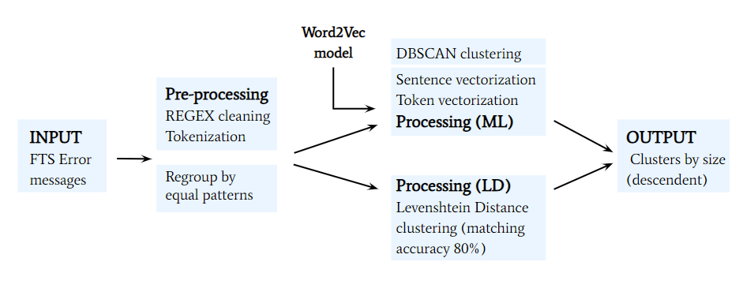

# Abstract
 This project work develops within the WLCG Operational Intelligence ([OpInt](https://operational-intelligence.web.cern.ch/)) group. OpInt is born as a common project among the Worldwide LHC Computing Grid ([WLCG](https://wlcg.web.cern.ch/)) communities with the purpose of creating solutions to increase the level of automation in computing operations and reduce human interventions.  Indeed the currently deployed systems have been successful in satisfying the experiment goals; however, the High Luminosity LHC era will significantly increase the volume of data around the world therefore requiring to automate the computing operations in order to efficiently manage the computing infrastructures. 

The system responsible for file transfer across the LHC Computing Grid is FTS. The File Transfer Service ([FTS](https://fts.web.cern.ch/fts/)) allows to sustain a data transfer rate of 20-40 GB/s, and it transfers daily a few millions files. When a transfer fails, it produces an error message that is managed by the system allowing to reach the shifters. The number of error messages per day to be monitored is of the order of a few hundred thousand. It is in this context that Machine Learning is looked at as a tool to develop smart solutions and optimize the resources. 

In particular, Natural Language Processing techniques can be applied to analyze FTS error messages. **The aim of this work is to group the error messages
into meaningful clusters in order to trustingly speed up the error detection process.**

The package used is `clusterlogs` ([here](https://github.com/maria-grigorieva/ClusterLog/tree/master)). In the following section you can find a brief description of the package (I'll report the author's description.)

# Clusterlogs package 
**Requirements:**
```
Python >= 3.7 < 3.8
```
This package doesn't work currently with python 2.7 because of `kneed` library, and with python 3.8 because of `gensim`.

```
editdistance==0.5.3
gensim==3.8.1
kneed==0.5.0
nltk==3.4.5
numpy==1.16.4
pandas==1.0.1
pyonmttok==1.10.1
scikit-learn==0.21.2
matplotlib==3.0.3
hdbscan==0.8.24
python-rake==1.4.5
pytextrank==2.0.1
Jinja2==2.11.1
```

Execute in command line to download dictionary required for pyTextRank library
```
python -m spacy download en_core_web_sm
```

**Input:**
   Pandas DataFrame with error log messages. DataFrame may have arbitrary columns and column names, but
   it must contain index column with IDs and column with text log messages. The name of log column is not
   fixed, but it must be specified explicitly in settings as 'target'.
   Possible structure of DataFrame is the following (in this example, `target='log_message'`):
   ```
   ID   |   log_message                                                            | timestamp
   -----------------------------------------------------------------------------------------------------
    1   |   No events to process: 16000 (skipEvents) >= 2343 (inputEvents of HITS  | 2019-10-01T10:18:49
    2   |   AODtoDAOD got a SIGKILL signal (exit code 137)                         | 2019-10-01T09:01:57
    ...
   ```
Required input:
- `df`
- `target`

Optional input:

- clusterization_settings
    - `w2v_size` (default: 100)
    - `w2v_window` (default: 7)
    - `min_samples` (default: 1)
- `model_name` (path to a file with word2vec model)
- `mode` ('create'(default) | 'update' | 'load')
- `output_file` (path to report file)
- `add_placeholder` (default: FALSE)
- `threshold` (clustering threshold, default = 5000)
- `matching_accuracy` (accuracy threshold, default = 0.8)
- `clustering_type` (ML | SIMILARITY, default=SIMILARITY)
- `algorithm` (dbscan|hdbscan|hierarchical, default=dbscan)

**Modes:**
1) `create`
    - Create word2vec model based on large sample of error logs
    - Save it to file ‘word2vec.model’ on server for further usage
2) `process`
    - Load word2vec model from file (without re-training the model)
3) `update`
    - Load word2vec model from file and train (update) this model with new error logs
    - Save updated model in file


**Clusterization of error log messages is implemented as a chain of methods:**

1) `data_preparation` - cleaning initial log messages from all substrings with digits
2) `grouping equals` - group dataframe by equal cleaned messages
2) `tokenization` - split each log message into tokens (`pyonmttok` + retaining spaces)
3) `tokens_vectorization` - train word2vec model
4) `sentence_vectorization` - convert word2vec to sent2vec model
5) `kneighbors` - calculate k-neighbors
6) `epsilon_search` - search epsilon for the DBSCAN algorithm
7) `dbscan` - execute DBSCAN clusterization, returns cluster labels
8) `reclusterization` - reclustering the existing clusters using the Levenshtein distances between sequences of tokens
9) `validation` - calculating similarity score for each cluster

**Output:**

The output is available in different views:
   1) `ALL` - DataFrame grouped by cluster numbers
   2) `INDEX` - dictionary of lists of indexes for all clusters
   3) `TARGET` - dictionary of lists of error messages for all clusters
   4) `cluster labels` - array of cluster labels (as output of `DBSCAN -> fit_predict()`)


**Clusters statistics:**

Clusters Statistics returns DataFrame or dictionary with statistic for all clusters:
- `cluster_name` - name of a cluster
- `cluster_size` - number of log messages in cluster
- `pattern` - all common substrings in messages in the cluster
- `mean_similarity` - average similarity of log messages in cluster
- `std_similarity` - standard deviation of similarity of log messages in cluster
- `indices` - indices of the initial dataframe, corresponding to the cluster


**Installation:**

```
pip install clusterlogs
```

**Usage:**
```
from clusterlogs import pipeline
```

**Author:**
maria.grigorieva@cern.ch (Maria Grigorieva)

# Error message analysis workflow
To follow, a schema of my analsyis workflow. In particular, I'll compare the clusters obtained:
* by computing the error message similarity (defined as Levenshtein Distance);
* by applying the DBSCAN algorithm after vectorizing the error messages (Word2Vec).



Once the error messages are cleaned and tokenized, the patterns that are equal are grouped together (equal groups) and clustered. In
case of the Machine Learning approach (ML), a Word2Vec model (already trained) allows to obtain the tokens vectorization and the error message is vectorized by averaging its
token-vectors. Finally the sentence-vectors feed the DBSCAN clustering algorithm. The state-of-the-art analysis clusters by Levenshtein distance (LD).
# How to install clusterlogs module on lxplus
Firstly, connect to lxplus:

`ssh <USERNAME>@lxplus.cern.ch>`

Go to a place where you want to have the repo and clone it there:

https://github.com/micolocco/ClusterLog.git

After cloning the repo:

`cd ClusterLog`

Set up a new virtual environment there:

`python3 -m venv new_env`

Activate your virtualenv:

`source new_env/bin/activate`

Get kerberos ticket:

`kinit <username>@CERN.CH`

Setup environment to use HADOOP with the following commands (assuming that the user has access to the Analytix cluster):

`source "/cvmfs/sft.cern.ch/lcg/views/LCG_96python3/x86_64-centos7-gcc8-opt/setup.sh"`

`source "/cvmfs/sft.cern.ch/lcg/etc/hadoop-confext/hadoop-swan-setconf.sh" analytix`

In this environment install the packages from requirements file,`clusterlogs` module and download dictionary required for pyTextRank library:

`python3 -m pip install --user -r requirements.txt`

`python3 -m spacy download --user en_core_web_sm `

`python3 -m pip  install --user clusterlogs`

done.

## After installation
Now your virtual env is set up correctly. Next time you access to lxplus follow these instructions:

`cd <yourfolder>`

`kinit <username>@CERN.CH`

`source new_env/bin/activate`

`source "/cvmfs/sft.cern.ch/lcg/views/LCG_96python3/x86_64-centos7-gcc8-opt/setup.sh"`

`source "/cvmfs/sft.cern.ch/lcg/etc/hadoop-confext/hadoop-swan-setconf.sh" analytix`

## How to run training_corpus.py
After you followed the instructions described [After installation](##-after-installation) section, enter:

`python3 training_corpus.py <modelname>.model <number_of_days_to_be_read>`

ex:`python3 training_corpus.py test.model 3`


